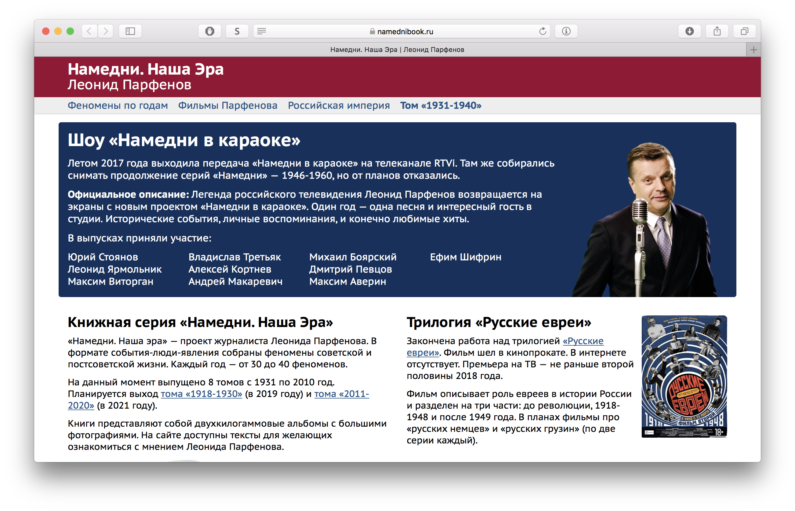

# Намедни. Наша Эра

> «Намедни. Наша эра» — проект журналиста Леонида Парфенова. В формате события-люди-явления собраны феномены советской и постсоветской жизни. Каждый год — от 30 до 40 феноменов.

На сайте [namednibook.ru ☠](https://namednibook.ru) более 2000 статей из 8 томов серии «Намедни», планируется разместить материалы из книжного проекта «Российская империя» и расшифровки документальных фильмов Леонида Парфенова.

